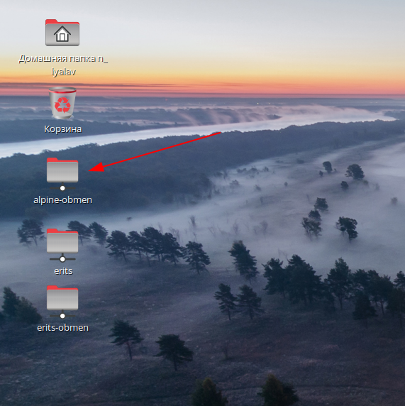

# DVEC

## Удаленное управление (помощь)
Для удаленного управления использую Vino-server. Настройка с автозапуском какв инструкции RedOS https://redos.red-soft.ru/base/server-configuring/remote-control/vino/

## Настройка sudo
Для настройки необходимо пользователя добавить в группу `wheel`
```
# usermod -a -G wheel n_lyalav
```
Применить настройки группы уже в сессии пользователя
```
$ newgrp wheel
```

## Настройка подключения SSH

## Удаленное подключение к рабочему столу пользователя с помощью Vino
Заходим по ссш на компьютер пользовалтеля в запускаем сервер Vino с правами пользователя
Делаем настройки для Vino сервера
```
gsettings set org.gnome.Vino prompt-enabled false 
gsettings set org.gnome.Vino require-encryption false 
dconf write /org/gnome/settings-daemon/plugins/sharing/vino-server/enabled-connections "['']"
```

## Подключение локального репозитория
В папке `/etc/yum.repos.d` создать файл `RedOS-Base-Dvec.repo`
```
[base-dvec]
enable=1
name=RedOS - Base
baseurl=http://172.18.174.6/repo/red-os-7.3/base
gpgcheck=1
gpgkey=file:///etc/pki/rpm-gpg/RPM-GPG-KEY-RED-SOFT
```
В файлы `RedOS-Base.repo` и `RedOS-Updates.repo` добавить в конец строку
```
enabled=0
```
после выполнить
```
dnf makecache 
dnf update
```

## Отключение SELinux
В файле `/etc/selinux/config` замените строку `SELINUX=enforcing` на `SELINUX=permissive`
можно сделать командой
```
sudo sed -i "s/SELINUX=enforcing/SELINUX=permissive/" /etc/selinux/config
```
Изменения применятся после перезагрузки. Для мгновенного отключения выполнить
```
sudo setenforce 0
```
## Ввод в домен
Ввод в домен едалть с помощью скрипта `join_to_domain`
```
sudo join-to-domain.sh -d prim.dvec.ru -n nhk-c00040979l -u nhk-admin -p password
```

## Подключение общих папок
Диски подключаются с правами авторизовавшегося пользователя. Работает при входе в графичечкую оболочку или консоль. Точка подключения `mountpoint` должна существовать. Папки прописанные в параметрах `mountpoint="/media/%(USER)/alpine-obmen"` будут созданы. Подключенные ресурсы отображаются на рабочем столе 



Установить `pam_mount`
```
dnf install pam_mount
```
Конфиг pam_mount `/etc/security/pam_mount.conf.xml`
После `<!--Volume definitions -->` добавить
```
<logout wait="50000" hup="1" term="1" kill="1" />
<cifsmount>mount.cifs //%(SERVER)/%(VOLUME) %(MNTPT)
-o %(OPTIONS) </cifsmount>
```
После `<!-- Описание тома, который должен монтироваться -->` добавить
Подключение общего диска с шары сервера Windows 2003, ключевые моменты `sec=krb5`, `vers=1.0` 
```
<volume fstype="cifs" server="alpine.prim.dvec.ru" path="Обмен" mountpoint="/media/%(USER)/alpine-obmen" options="user=%(USER),rw,setuids,perm,soft,sec=krb5,cruid=%(USERUID),iocharset=utf8,vers=1.0"/>
```
Для подключения шары Winodws 2008 сервер
```
<volume fstype="cifs" server="nhk-erits-srv.prim.dvec.ru" path="Обмен" mountpoint="/media/%(USER)/erits-obmen" options="user=%(USER),rw,setuids,perm,soft,sec=krb5i,cruid=%(USERUID),iocharset=utf8"/>
<volume fstype="cifs" server="nhk-erits-srv.prim.dvec.ru" path="Ериц" mountpoint="/media/%(USER)/erits" options="user=%(USER),rw,setuids,perm,soft,sec=krb5i,cruid=%(USERUID),iocharset=utf8"/>
```
Добавить в файлы `/etc/pam.d/postlogin` вызова соответствующих модулей
```
session optional pam_mount.so disable_interactive
```

